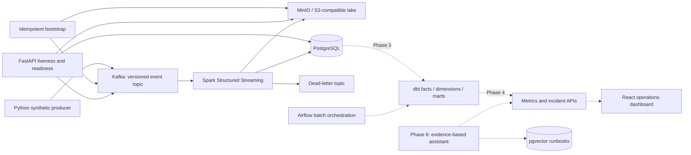

# PulseForge

**A real-time data and AI operations platform for synthetic commerce and logistics.**

PulseForge explores how an engineering team can trace business events from ingestion
to reliable operational decisions: preserve the original event, validate its contract,
process it once at the sink, model the business, detect explainable anomalies, and
show the evidence behind an incident.

**Current milestone: Phase 2 — streaming data platform.** The Phase 1 foundation now
feeds a Spark Structured Streaming application that validates and deduplicates events,
routes rejected records, archives raw and cleaned Parquet, and writes idempotent event
and minute-metric tables to PostgreSQL. dbt, Airflow, the dashboard, anomaly detection
and the AI assistant remain planned; they are not represented as working features.
All generated data is synthetic.

See the [implementation checklist](docs/architecture/implementation-plan.md) and
[actual verification record](docs/verification.md).

## Business problem

A payment provider can fail in one region while aggregate revenue still looks normal.
Shipment delays and refunds can follow later. Teams need fresh metrics, trustworthy
data and a reproducible path from an alert back to its source events. PulseForge's
target workflow connects those stages without making an LLM responsible for detection.

## Architecture

Solid arrows describe implemented paths. Dashed arrows describe future phases.



| Layer | Technology | Purpose and status |
| --- | --- | --- |
| Contracts / producer | Python, Pydantic, aiokafka | Implemented: versioned validation, journeys, fault injection, confirmed delivery |
| Event backbone | Kafka in KRaft mode | Implemented: three partitions, event and dead-letter topics, seven-day retention |
| Database | PostgreSQL, SQLAlchemy, asyncpg, psycopg | Implemented: readiness plus idempotent event and minute-metric sinks |
| Lake | MinIO, boto3, Parquet | Implemented: lossless raw and validated cleaned stream archives |
| API | FastAPI | Implemented: liveness, dependency readiness, OpenAPI, request IDs, JSON logs |
| Processing | Spark Structured Streaming | Implemented: validation, watermark deduplication, DLQ routing and checkpoints |
| Modeling / orchestration | dbt, Airflow | Phase 3 |
| Product | React, TypeScript, Redis | Phase 4 |
| Telemetry | Prometheus, Grafana, OpenTelemetry | Phase 5 |
| Assistant | pgvector, provider abstraction | Phase 6, optional paid provider, offline support |
| Deployment | Kubernetes, Terraform AWS | Phase 7, gated on local verification |

## Local setup

Prerequisites: Docker Desktop with Linux containers, Docker Compose v2, Git and
[uv](https://docs.astral.sh/uv/getting-started/installation/). Allow approximately
4 GB of Docker memory for the foundation and approximately 6 GB when Spark is enabled.
Commands work in PowerShell and Bash unless noted.

```sh
git clone https://github.com/kanishk-sc/pulseforge.git
cd pulseforge
uv sync --frozen
uv run python scripts/init_env.py
docker compose up -d --build --wait --wait-timeout 180
```

The environment script generates random credentials in ignored `.env`, and preserves
an existing file. Alternatively copy `.env.example` to `.env` and fill in both password
values yourself. Blank credentials deliberately fail Compose validation. Never commit
`.env`. All published ports bind to localhost; this is a development stack without TLS
or application authentication, and must not be exposed to the Internet.

| Service | Local address |
| --- | --- |
| API documentation | http://localhost:8000/docs |
| API liveness | http://localhost:8000/health |
| Dependency readiness | http://localhost:8000/ready |
| MinIO console | http://localhost:9001 (credentials from `.env`) |
| S3 endpoint | http://localhost:9000 |
| Kafka bootstrap | localhost:9092 |
| PostgreSQL | localhost:5432 |
| Spark streaming UI | http://localhost:4040 (while the streaming profile is running) |

Initialization creates `commerce.events.v1`, `commerce.dead-letter.v1`, and the
`pulseforge` bucket. It is safe to rerun. The Spark application creates its two
`analytics` tables and staging tables idempotently at startup.

### Run the streaming pipeline

Start Spark explicitly; the default stack remains useful for foundation-only work:

```sh
docker compose --profile streaming up -d --build spark
docker compose logs -f spark
```

Spark starts five checkpointed queries. Every Kafka value is archived losslessly under
`raw/stream_events`; valid events are deduplicated by `event_id`, archived under
`cleaned/stream_events`, inserted into `analytics.stream_events`, and aggregated into
`analytics.stream_metrics_minute`. Invalid records go to `commerce.dead-letter.v1`
with stable reason codes, source offsets, decoded text when available, and base64 bytes.
The raw archive is intentionally at-least-once evidence; accepted warehouse rows are
idempotent through primary and source-offset constraints.

Inspect the stream outputs:

```sh
docker compose exec postgres psql -U pulseforge -d pulseforge -c "TABLE analytics.stream_metrics_minute;"
docker compose exec kafka /opt/kafka/bin/kafka-console-consumer.sh --bootstrap-server kafka:29092 --topic commerce.dead-letter.v1 --from-beginning --max-messages 5
```

### Generate and inspect events

Start continuous traffic explicitly so the default stack does not fill Kafka unattended:

```sh
docker compose --profile traffic up -d producer
docker compose logs -f producer
docker compose stop producer
```

Produce a bounded scenario, then inspect records:

```sh
docker compose run --rm producer python -m pulseforge.producer --count 100 --scenario payment-spike
docker compose exec kafka /opt/kafka/bin/kafka-console-consumer.sh --bootstrap-server kafka:29092 --topic commerce.events.v1 --from-beginning --max-messages 5
```

Scenarios: `normal`, `payment-spike`, `refund-spike`, `shipment-delays`, `large-orders`.
Set `EVENTS_PER_SECOND`, `ANOMALY_RATE` and `GENERATOR_SEED` in `.env`. To send only
schema-valid events for a controlled experiment:

```sh
docker compose run --rm -e ANOMALY_RATE=0 producer python -m pulseforge.producer --count 100
```

Events cover `customer_login`, `order_created`, `payment_processed`, `payment_failed`,
`shipment_created`, `shipment_delayed`, `refund_requested`, and `inventory_updated`.
A journey shares customer, order, product and region; failed payments do not ship.
Amounts use decimal USD values, serialized as strings to avoid binary floating-point
loss. A fixed seed reproduces choices and IDs when the clock is fixed. A producer
restart with the same seed intentionally repeats IDs, a useful replay/deduplication
test; use a different seed for a new independent simulation.

`ANOMALY_RATE` controls transport corruption: duplicate records, malformed JSON and
missing event IDs. Business spikes are separate scenario parameters. Invalid records
enter the event topic intentionally. Spark preserves every record in the raw lake and
routes rejected inputs to the dead-letter topic; it never treats a business spike as
malformed transport data. The generator validates good events before serializing them,
then corrupts selected bytes deliberately.

### Example API usage

```sh
curl http://localhost:8000/health
curl -H "X-Request-ID: demo-001" http://localhost:8000/ready
```

In PowerShell, use `curl.exe` or `Invoke-RestMethod`. `/health` reports process liveness;
`/ready` checks a real PostgreSQL query, the Kafka event topic, and the S3 bucket. It
returns HTTP 503 when a dependency is unavailable and never returns raw connection
errors. Metrics and incident endpoints will arrive with populated data in Phase 4.

### Development and tests

```sh
uv run ruff format --check .
uv run ruff check .
uv run pytest -m "not integration"
docker compose --profile streaming up -d --build --wait --wait-timeout 240
uv run pytest -m integration --run-integration
```

The integration command requires the streaming Compose profile. It verifies Kafka
delivery/readback, S3 write/read/delete, PostgreSQL transactions, API readiness,
repeated bootstrap, and valid/invalid events across every Spark sink.
Integration tests skip by default rather than silently pretending to use real services.
CI runs lint, unit/API tests, Docker builds and the real Compose integration suite
without private secrets. Frontend and dbt CI will be added with their implementations.

For host API development, stop the container API first, then run:

```sh
docker compose stop api
uv run uvicorn pulseforge.api:app --reload --no-access-log
```

`make setup`, `make up`, `make traffic`, `make lint`, `make test` and `make integration`
are optional shortcuts when Make is installed. The explicit commands above work on
Windows without Make. `docker compose down` stops the stack and preserves its data.

## Data models and event flow

The current source contract is `src/pulseforge/events.py`, exported as JSON Schema at
`schemas/commerce-event.v1.json`. Runtime validation additionally enforces timezone and
timestamp bounds, per-type required fields and inventory quantity rules. JSON Schema
alone cannot express all of those checks; consumers must use the runtime validator.

The stream warehouse uses event-grain staging with `event_id` and Kafka-position
uniqueness. Transactional staging cleanup plus `ON CONFLICT DO NOTHING` makes retrying
a partially failed microbatch safe. The planned dbt layer adds customer/product/region
dimensions and business facts for orders/payments/shipments/refunds. Those facts will
retain source event references. dbt marts will calculate hourly revenue,
payment failure rates, shipment performance, refunds and operational health, with
explicit denominators and late-arrival handling. See [design decisions](docs/architecture/architecture.md).

## Observability and AI

Today, API, producer and streaming application logs are JSON. API responses include a
validated or generated request ID. Producer logs distinguish acknowledged events from a failed delivery.
Dependency failures are visible through readiness, independent of API liveness.
Phase 5 adds metrics and traces after the pipeline has meaningful measurements.

The planned assistant retrieves runbooks, incident evidence and recent metrics before
responding. Statistical detection remains outside the LLM. The main platform will
remain functional without an LLM key; offline output will be labeled as an evidence
summary. Evaluation will distinguish measured retrieval/latency metrics from human
judgments of usefulness. No AI accuracy results exist yet.

## Screenshots and benchmarks

No dashboard screenshot is included because the dashboard is not implemented yet.
No load-test performance numbers are claimed. The foundation verification record is
a functional test report, not a benchmark. Later benchmark reports will identify the
environment, concurrency, throughput, p50/p95/p99 and error rate.

## Engineering decisions and next milestones

- Kafka decouples event ingestion from downstream outages and supports replay.
- KRaft and one broker keep local setup small; this is not a highly available deployment.
- Producer idempotence handles broker retries within a session. Spark applies event-time
  deduplication, while PostgreSQL uniqueness is the durable backstop across restarts.
- Readiness probes fail closed, with bounded calls; liveness stays independent.
- One Python package shares contracts across separately runnable services. Separate
  Python projects would add packaging overhead before independent release cycles exist.
- No placeholder infrastructure, empty application folders, fake charts or fabricated scores.

Next is dbt modeling and Airflow orchestration over the populated stream warehouse.
Subsequent phases add operational APIs, the dashboard,
observability and evidence-based AI. Kubernetes and AWS Terraform follow only after
the local application works; no paid infrastructure is created automatically.
