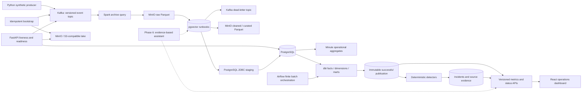

# PulseForge

**A real-time data and AI operations platform for synthetic commerce and logistics.**

PulseForge explores how an engineering team can trace business events from ingestion
to reliable operational decisions: preserve the original event, validate its contract,
process it once at the sink, model the business, detect explainable anomalies, and
show the evidence behind an incident.

**Current milestone: Phase 5 — observability and reliability, under PR review.**
Kafka ingestion, Spark Structured Streaming, raw/cleaned/curated Parquet, a dead-letter
pipeline, an idempotent PostgreSQL sink, dbt analytics and finite Airflow orchestration
are implemented. Successful analytics are atomically published to a versioned FastAPI
surface, deterministic detectors persist evidence-backed incidents, and the React
dashboard exposes the result. The AI assistant remains future work. All generated data
is synthetic.

See the [implementation checklist](docs/architecture/implementation-plan.md) and
[actual verification record](docs/verification.md).

## Demo

There is no hosted demo. The full system is reproducible with Docker Compose; the
dashboard runs at `http://localhost:5173` and reads real dbt marts through FastAPI.
No screenshot is checked in because the current evidence is the runnable path and its
tests rather than a staged image.

## Business problem

A payment provider can fail in one region while aggregate revenue still looks normal.
Shipment delays and refunds can follow later. Teams need fresh metrics, trustworthy
data and a reproducible path from an alert back to its source events. PulseForge's
target workflow connects those stages without making an LLM responsible for detection.

## Architecture

Solid arrows describe implemented paths. Dashed arrows describe future phases.



| Layer | Technology | Purpose and status |
| --- | --- | --- |
| Contracts / producer | Python, Pydantic, aiokafka | Implemented: versioned validation, journeys, fault injection, confirmed delivery |
| Event backbone | Kafka in KRaft mode | Implemented: three partitions, event and dead-letter topics, seven-day retention |
| Database | PostgreSQL, SQLAlchemy, asyncpg, psycopg, JDBC | Unique stream events, transactional batch ledger and minute aggregates |
| Lake | MinIO, S3A, Parquet | Immutable raw evidence; committed cleaned/curated batches |
| API | FastAPI | Implemented: liveness, dependency readiness, OpenAPI, request IDs, JSON logs |
| Streaming | Spark 4.0.1, PySpark, Kafka connector | Event-time deduplication, DLQ, checkpoint recovery and JDBC staging |
| Modeling | dbt, Airflow | Implemented: documented facts/dimensions/marts, tests and finite hourly DAG |
| Product | React, TypeScript, Redis | Implemented: build-aware APIs, detectors, incidents and evidence UI |
| Telemetry | Prometheus, Grafana, OpenTelemetry | Phase 5 |
| Assistant | pgvector, provider abstraction | Phase 6, optional paid provider, offline support |
| Deployment | Terraform, AWS ECS/RDS/ElastiCache/S3/ECR | Validated configuration; not applied or publicly deployed |

## Key engineering features

- Lossless raw Kafka evidence, explicit dead-letter reasons and watermark-aware deduplication
- Idempotent PostgreSQL sinks backed by event and source-offset uniqueness constraints
- dbt event-grain facts and tested marts with business denominators kept explicit
- Airflow batch orchestration separated from Spark's checkpoint-owned streaming lifecycle
- Redis-cached typed analytics APIs with direct-warehouse fallback during cache failure
- Real-data React dashboard plus bounded-cardinality Prometheus metrics and optional traces

## Tech stack

Python 3.12, SQL, TypeScript, React, FastAPI, Pydantic, Kafka, Spark Structured
Streaming, PostgreSQL, SQLAlchemy, MinIO/S3, dbt, Airflow, Redis, Prometheus, Grafana,
OpenTelemetry, Docker Compose, Terraform, pytest and GitHub Actions.

## Local setup

Prerequisites: Docker Desktop with Linux containers, Docker Compose v2, Git and
[uv](https://docs.astral.sh/uv/getting-started/installation/). Allow approximately
4 GB of Docker memory for the foundation and 8 GB when running Spark and Airflow
together.
Commands work in PowerShell and Bash unless noted.

```sh
git clone https://github.com/kanishk-sc/pulseforge.git
cd pulseforge
uv sync --frozen
uv run python scripts/init_env.py
docker compose up -d --build --wait --wait-timeout 180
```

The environment script generates random credentials in ignored `.env`, and preserves
an existing file. Alternatively copy `.env.example` to `.env` and fill in both password
values yourself. Blank credentials deliberately fail Compose validation. Never commit
`.env`. All published ports bind to localhost; this is a development stack without TLS
or application authentication, and must not be exposed to the Internet.

| Service | Local address |
| --- | --- |
| API documentation | http://localhost:8000/docs |
| API liveness | http://localhost:8000/health |
| Dependency readiness | http://localhost:8000/ready |
| MinIO console | http://localhost:9001 (credentials from `.env`) |
| S3 endpoint | http://localhost:9000 |
| Kafka bootstrap | localhost:9092 |
| PostgreSQL | localhost:5432 |
| Airflow UI (optional profile) | http://localhost:8080 |

Initialization creates `commerce.events.v1`, `commerce.dead-letter.v1`, and the
`pulseforge` bucket. It is safe to rerun. Starting streaming also runs the idempotent
`warehouse.sql` schema initialization. dbt reads those Phase 2 tables without changing
their schema or sink semantics.

### Generate and inspect events

Start continuous traffic explicitly so the default stack does not fill Kafka unattended:

```sh
docker compose --profile traffic up -d producer
docker compose logs -f producer
docker compose stop producer
```

Produce a bounded scenario, then inspect records:

```sh
docker compose run --rm producer python -m pulseforge.producer --count 100 --scenario payment-spike
docker compose exec kafka /opt/kafka/bin/kafka-console-consumer.sh --bootstrap-server kafka:29092 --topic commerce.events.v1 --from-beginning --max-messages 5
```

Scenarios: `normal`, `payment-spike`, `refund-spike`, `shipment-delays`, `large-orders`.
Set `EVENTS_PER_SECOND`, `ANOMALY_RATE` and `GENERATOR_SEED` in `.env`. To send only
schema-valid events for a controlled experiment:

```sh
docker compose run --rm -e ANOMALY_RATE=0 producer python -m pulseforge.producer --count 100
```

Events cover `customer_login`, `order_created`, `payment_processed`, `payment_failed`,
`shipment_created`, `shipment_delayed`, `refund_requested`, and `inventory_updated`.
A journey shares customer, order, product and region; failed payments do not ship.
Amounts use decimal USD values, serialized as strings to avoid binary floating-point
loss. A fixed seed reproduces choices and IDs when the clock is fixed. A producer
restart with the same seed intentionally repeats IDs, a useful replay/deduplication
test; use a different seed for a new independent simulation.

`ANOMALY_RATE` controls transport corruption: duplicate records, malformed JSON and
missing event IDs. Business spikes are separate scenario parameters. Invalid records
enter the event topic intentionally; Spark archives them and routes them to the
dead-letter topic. The generator validates good events before
serializing them, then corrupts selected bytes deliberately.

### Start and inspect streaming

Spark runs behind a profile so the lightweight API/foundation remains independent.
Allow Docker approximately 6 GB of memory for the combined platform. The streaming
container is capped at 3 GB and uses `local[2]`, not a pretend distributed cluster.
The first image build downloads Spark and its pinned JVM dependencies.

```sh
docker compose --profile streaming up -d --build --wait --wait-timeout 240
docker compose logs -f streaming
docker compose run --rm -e ANOMALY_RATE=0.25 producer python -m pulseforge.producer --count 100
docker compose exec kafka /opt/kafka/bin/kafka-console-consumer.sh --bootstrap-server kafka:29092 --topic commerce.dead-letter.v1 --from-beginning --max-messages 5
uv run python -m pulseforge.streaming.inspect --layer raw --limit 3
uv run python -m pulseforge.streaming.inspect --layer cleaned --limit 3
uv run python -m pulseforge.streaming.inspect --layer curated --limit 3
docker compose exec postgres psql -U pulseforge -d pulseforge -c "SELECT event_type,count(*) FROM stream_events GROUP BY 1;"
docker compose exec postgres psql -U pulseforge -d pulseforge -c "SELECT * FROM stream_metrics_minute ORDER BY window_start DESC LIMIT 10;"
```

The SQL examples use the default local username/database; substitute values from `.env`
if changed. In MinIO's console, browse the `pulseforge` bucket: `raw/v1`, `cleaned/v1`,
`curated/v1`, `commits/v1`, and `checkpoints/`. The host inspection command uses PyArrow
from the development dependencies and reads **committed files only**. It loads the
small demo dataset into memory; it is not a production query engine. Do not recursively
scan arbitrary lake files as though in-progress attempts were committed data.

To restart safely without discarding offsets or deduplication state:

```sh
docker compose stop streaming
docker compose --profile streaming up -d --wait --wait-timeout 180 streaming
```

All three checkpoints live in MinIO. Retain the checkpoint and lake metadata together.
On a correctness-critical sink failure Spark exits; restore the dependency and use the
same restart command. It does not auto-restart forever and conceal a failed sink.

The ten-minute watermark bounds the live deduplication state. Very late records can be
excluded from live cleaned/warehouse output; their bytes remain in raw and Spark logs
the dropped count. Planned offline reconciliation must use the raw archive. Do not
delete a checkpoint to repair a transient outage. Read [failure semantics](docs/architecture/phase-2-design.md)
before changing namespaces or planning a backfill.

### Build and schedule analytics

dbt runs in an opt-in, short-lived container. It reads the Phase 2 `public` source
tables and creates `analytics_staging`, `analytics_core` and `analytics_marts`:

```sh
docker compose --profile analytics build analytics-dbt
docker compose --profile analytics run --rm analytics-dbt build
docker compose --profile analytics run --rm analytics-dbt test
```

`dbt build` is the normal command because it runs models and tests in dependency
order. Running `dbt test` separately is useful after inspecting or changing data.
The event staging table captures one committed source snapshot per full build.
Events accepted afterward enter the next build. Facts merge on their source event UUID;
repeating a run or replaying an accepted UUID
does not increase the fact grain. Accepted late arrivals are included on the next run.
Run one analytics build per target schema at a time, including manual runs alongside
Airflow. The project is mounted read-only; CLI target artifacts and logs live in the
short-lived container under `/tmp/dbt-target` and `/tmp/dbt-logs`. Standard output
remains available to the caller. Airflow retains its own build artifacts for the summary.

Airflow is also optional. It runs the same finite build every hour and never starts,
stops or retries Spark:

```sh
docker compose --profile airflow up -d --build --wait --wait-timeout 180 airflow
docker compose exec airflow cat /opt/airflow/state/simple_auth_manager_passwords.json.generated
```

Open http://localhost:8080 and sign in as `pulseforge` with the generated password.
The password file is stored only in the ignored Airflow state volume; no default
password is committed. The DAG's path is `verify_warehouse -> dbt_build ->
quality_summary`. The middle task runs dbt, atomically publishes the successful build,
then evaluates finite detectors. Trigger it in the UI, or verify the DAG with:

```sh
docker compose --profile airflow run --rm --no-deps airflow python /opt/pulseforge/scripts/verify_airflow_dag.py
docker compose exec airflow airflow dags test pulseforge_analytics 2026-09-09T18:00:00+00:00
```

The second command creates a real local Airflow test run for the supplied logical
timestamp and writes analytics data. See the [Phase 3 design](docs/architecture/phase-3-design.md)
for model grains, metric denominators and failure/recovery behavior.

### Example API usage

```sh
curl http://localhost:8000/health
curl -H "X-Request-ID: demo-001" http://localhost:8000/ready
curl "http://localhost:8000/api/v1/payment-health?start=2026-09-20T00:00:00Z&end=2026-09-21T00:00:00Z&region=ap-south"
curl http://localhost:8000/api/v1/analytics/status
curl "http://localhost:8000/api/v1/incidents?status=open"
curl http://localhost:8000/metrics
```

In PowerShell, use `curl.exe` or `Invoke-RestMethod`. `/health` reports process liveness;
`/ready` checks a real PostgreSQL query, the Kafka event topic, and the S3 bucket. It
returns HTTP 503 when a dependency is unavailable and never returns raw connection
errors. Product responses read only the newest successful immutable publication and
include its build/freshness context. Decimal money and rates remain strings. Redis
caches successful responses for 60 seconds by default; if unavailable, the API reads
PostgreSQL directly. Running or failed builds never replace the last success, stale
success is labeled, and no successful publication returns 503 rather than made-up data.

### Run the product and observability layers

Migrate the product schema, publish tested analytics, then start the dashboard:

```sh
docker compose --profile product run --rm --build product-migrate
docker compose --profile airflow build airflow
docker compose --profile airflow run --rm --no-deps airflow python -m pulseforge.product.cli pipeline --build-key local-product-build --project-dir /opt/pulseforge/analytics --profiles-dir /opt/pulseforge/analytics
docker compose --profile product up -d --build --wait --wait-timeout 180 redis api dashboard
docker compose --profile observability up -d prometheus grafana
```

The React/TypeScript client polls typed endpoints and renders loading, empty and error
states. Nginx serves the production bundle and proxies `/api` to FastAPI. Grafana loads
the checked-in dashboard and Prometheus datasource automatically. Set
`OTEL_EXPORTER_OTLP_ENDPOINT` only when an OTLP/HTTP collector is available; traces are
otherwise disabled without affecting requests.

To reproduce the detector acceptance scenario, run
`uv run python scripts/seed_product_acceptance.py` before the pipeline command and pass
its `detector_now` value with `--detector-now`. The fixture uses the existing replay-safe
ingestion boundary and is idempotent within its evaluation hour. See the
[Phase 4 design](docs/architecture/phase-4-design.md) for publication and detector
semantics.

### Development and tests

```sh
uv run ruff format --check .
uv run ruff check .
uv run pytest -m "not integration" --basetemp=.pytest_cache/unit-tmp
uv run pytest -m integration --run-integration --basetemp=.pytest_cache/integration-tmp
uv run pytest --run-integration --run-streaming --basetemp=.pytest_cache/streaming-tmp
uv run pytest -m analytics --run-integration --run-analytics --basetemp=.pytest_cache/analytics-tmp
uv run pytest tests/test_product_integration.py --run-integration --run-product
npm test -- --run --prefix frontend
uv run pytest --run-integration --run-streaming --run-analytics --basetemp=.pytest_cache/full-tmp
```

The second pytest command requires Compose. It verifies Kafka delivery/readback,
S3 write/read/delete, PostgreSQL transactions, API readiness and repeated bootstrap.
The streaming flag additionally exercises actual CLI producer → Spark → lake/warehouse,
DLQ payload fidelity, duplicates, minute totals, watermark drops, restart and database
outage/recovery. These tests intentionally stop/restart local services: run against a
development stack, without another traffic generator. Integration tests skip by default.
The analytics flag creates a disposable database with the exact Phase 2 schema, loads
deterministic events through the real sink, runs dbt twice and checks exact facts,
marts, lineage and replay stability. CI keeps Python, streaming, analytics and product
integration jobs independent and requires no private secrets. The product job seeds an
anomaly, runs the real publication pipeline, starts the API/dashboard and checks exact
incident evidence. All Phase 3 jobs passed in
[Phase 3 hosted CI](https://github.com/kanishk-sc/pulseforge/actions/runs/35117743583).

For host API development, stop the container API first, then run:

```sh
docker compose stop api
uv run uvicorn pulseforge.api:app --reload --no-access-log
```

`make setup`, `make up`, `make traffic`, `make lint`, `make test`, `make integration`,
`make analytics-build`, `make analytics-test`, `make analytics-verify`, `make airflow`
and `make airflow-verify` are optional shortcuts when Make is installed. The explicit
commands above work on Windows without Make. `docker compose down` stops the stack and
preserves its data.

## Data models and event flow

The current source contract is `src/pulseforge/events.py`, exported as JSON Schema at
`schemas/commerce-event.v1.json`. Runtime validation additionally enforces timezone and
timestamp bounds, per-type required fields and inventory quantity rules. JSON Schema
alone cannot express all of those checks; consumers must use the runtime validator.

The analytics warehouse uses event-grain staging with `event_id` uniqueness, Type 1
customer/product dimensions, a fixed region dimension and source-lineage facts for
orders, payment attempts, created shipments and refund requests. Hourly marts calculate
successful-payment revenue, payment failure rates, created-shipment cohort delay rates,
refund requests and combined operational features. Exact grains and denominators are
documented in the [Phase 3 design](docs/architecture/phase-3-design.md).

## Observability and AI

API, producer and streaming application logs are JSON; Spark's JVM logs retain their
native diagnostic format. API responses include a validated or generated request ID.
Producer logs distinguish acknowledged events from a failed delivery. Streaming logs
report batch input/insert counts and watermark drops. The Spark container health check
reports live query threads, not an end-to-end latency or freshness guarantee.
Dependency failures are visible through readiness, independent of API liveness.
Phase 5 adds local Prometheus, Grafana, Tempo and OpenTelemetry collection behind an
optional Compose profile. The API, Spark driver, producer and a PostgreSQL-backed
finite-job exporter expose bounded operational signals. These are diagnostic views;
no heartbeat alone proves end-to-end delivery. See the
[Phase 5 signal contract](docs/architecture/phase-5-design.md) and
[runbooks](docs/operations/runbooks.md).

The planned assistant retrieves runbooks, incident evidence and recent metrics before
responding. Statistical detection remains outside the LLM. The main platform will
remain functional without an LLM key; offline output will be labeled as an evidence
summary. Evaluation will distinguish measured retrieval/latency metrics from human
judgments of usefulness. No AI accuracy results exist yet.

## Deployment target

[`infra/terraform`](infra/terraform) defines a cost-conscious AWS target with an ALB,
two Fargate services, encrypted RDS PostgreSQL, encrypted ElastiCache Redis, versioned
S3, immutable/scanned ECR repositories, CloudWatch logs, Secrets Manager and scoped
task roles. It validates without credentials and has never been applied. The module
does not pretend to deploy Kafka, Spark or Airflow; choosing their managed or operated
targets requires workload and cost evidence first. See its README for exact validation,
security gaps and billable-resource warnings.

## Current status

Implemented: event contracts and generation, Kafka/Spark processing, raw/cleaned lake,
idempotent PostgreSQL sinks, dbt models/tests, Airflow orchestration, immutable analytics
publication, versioned cached APIs, deterministic incidents/evidence, React operations
dashboard, API/Spark/producer/finite-job telemetry, Grafana/Tempo provisioning,
bounded local reliability acceptance, Compose and CI.

In progress: hosted Phase 5 PR checks and review; the local acceptance evidence is
recorded, but the branch is not merged.

Planned: retrieval-grounded operations assistance and any
real cloud deployment.

## Screenshots and benchmarks

Phase 5 [bounded local measurements](docs/benchmarks/phase5-report.md) and
[verification](docs/verification.md) record environment, concurrency, throughput,
p50/p95/p99, error counts and an interrupted attempt. They are not production SLAs.

## Engineering decisions and next milestones

- Kafka decouples event ingestion from downstream outages and supports replay.
- KRaft and one broker keep local setup small; this is not a highly available deployment.
- Producer idempotence handles broker retries within a session. Spark applies event-time
  deduplication, while PostgreSQL uniqueness is the durable backstop across restarts.
- Readiness probes fail closed, with bounded calls; liveness stays independent.
- One Python package shares contracts across separately runnable services. Separate
  Python projects would add packaging overhead before independent release cycles exist.
- Redis is a disposable acceleration layer; PostgreSQL/dbt marts remain authoritative.
- The dashboard contains no fake values and exposes upstream empty/error conditions.
- Terraform models an interview-defensible deployment boundary without applying paid infrastructure.

Phase 4's operational APIs, explainable anomaly detectors and dashboard are complete.
Phase 5 adds operational evidence and bounded reliability experiments. Evidence-based
AI is a later, separate phase. No paid infrastructure is created automatically.

## Optional local observability

Run `uv run python scripts/init_env.py` once to generate a local Grafana password without
replacing existing credentials. In PowerShell, start the optional stack and enable API
trace export with:

```powershell
$env:OTEL_EXPORTER_OTLP_ENDPOINT='http://otel-collector:4318'
docker compose --profile observability up -d --build --wait api ops-exporter prometheus tempo otel-collector grafana
docker compose --profile product run --rm --no-deps product-migrate
```

Grafana is at `http://127.0.0.1:3000` (user `admin`, generated password in `.env`),
Prometheus at `http://127.0.0.1:9090`, and Tempo at `http://127.0.0.1:3200`.
The default `docker compose up -d --build --wait` remains unchanged. Stop only the
optional services with
`docker compose --profile observability stop grafana prometheus tempo otel-collector ops-exporter`;
do not use `down -v` because that removes development data. See the runbooks for
signals, safe failure drills and load-test commands.
