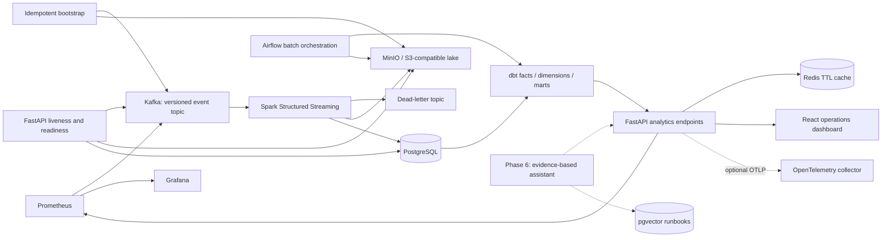

# PulseForge

**A real-time data and AI operations platform for synthetic commerce and logistics.**

PulseForge explores how an engineering team can trace business events from ingestion
to reliable operational decisions: preserve the original event, validate its contract,
process it once at the sink, model the business, detect explainable anomalies, and
show the evidence behind an incident.

The implemented path runs from synthetic events through Kafka, Spark, PostgreSQL/MinIO,
dbt and Airflow to a cached analytics API and React operations dashboard. Prometheus
scrapes bounded-cardinality API metrics, Grafana is provisioned from source, and
FastAPI can export OpenTelemetry traces. Explainable anomaly detection, persisted
incidents and the evidence-based assistant remain planned. All generated data is
synthetic; no public deployment or performance result is claimed.

See the [implementation checklist](docs/architecture/implementation-plan.md) and
[actual verification record](docs/verification.md).

## Demo

There is no hosted demo. The full system is reproducible with Docker Compose; the
dashboard runs at `http://localhost:5173` and reads real dbt marts through FastAPI.
No screenshot is checked in because the current evidence is the runnable path and its
tests rather than a staged image.

## Business problem

A payment provider can fail in one region while aggregate revenue still looks normal.
Shipment delays and refunds can follow later. Teams need fresh metrics, trustworthy
data and a reproducible path from an alert back to its source events. PulseForge's
target workflow connects those stages without making an LLM responsible for detection.

## Architecture

Solid arrows describe implemented paths. Dashed arrows describe future phases.



| Layer | Technology | Purpose and status |
| --- | --- | --- |
| Contracts / producer | Python, Pydantic, aiokafka | Implemented: versioned validation, journeys, fault injection, confirmed delivery |
| Event backbone | Kafka in KRaft mode | Implemented: three partitions, event and dead-letter topics, seven-day retention |
| Database | PostgreSQL, SQLAlchemy, asyncpg, psycopg | Implemented: readiness plus idempotent event and minute-metric sinks |
| Lake | MinIO, boto3, Parquet | Implemented: lossless raw and validated cleaned stream archives |
| API | FastAPI | Implemented: health/readiness, typed analytics and pipeline APIs, request IDs, JSON logs |
| Processing | Spark Structured Streaming | Implemented: validation, watermark deduplication, DLQ routing and checkpoints |
| Modeling | dbt-postgres | Implemented: event facts, observed dimensions, hourly business and quality marts |
| Orchestration | Airflow | Implemented: analytics, quality-report and retention DAGs |
| Product | React, TypeScript, Recharts, Redis | Implemented: real mart data, polling, TTL cache and failure states |
| Telemetry | Prometheus, Grafana, OpenTelemetry | Implemented for the API; Spark/Kafka-native telemetry remains future work |
| Assistant | pgvector, provider abstraction | Phase 6, optional paid provider, offline support |
| Deployment | Terraform, AWS ECS/RDS/ElastiCache/S3/ECR | Validated configuration; not applied or publicly deployed |

## Key engineering features

- Lossless raw Kafka evidence, explicit dead-letter reasons and watermark-aware deduplication
- Idempotent PostgreSQL sinks backed by event and source-offset uniqueness constraints
- dbt event-grain facts and tested marts with business denominators kept explicit
- Airflow batch orchestration separated from Spark's checkpoint-owned streaming lifecycle
- Redis-cached typed analytics APIs with direct-warehouse fallback during cache failure
- Real-data React dashboard plus bounded-cardinality Prometheus metrics and optional traces

## Tech stack

Python 3.12, SQL, TypeScript, React, FastAPI, Pydantic, Kafka, Spark Structured
Streaming, PostgreSQL, SQLAlchemy, MinIO/S3, dbt, Airflow, Redis, Prometheus, Grafana,
OpenTelemetry, Docker Compose, Terraform, pytest and GitHub Actions.

## Local setup

Prerequisites: Docker Desktop with Linux containers, Docker Compose v2, Git and
[uv](https://docs.astral.sh/uv/getting-started/installation/). Allow approximately
4 GB of Docker memory for the foundation and approximately 6 GB when Spark is enabled.
Commands work in PowerShell and Bash unless noted.

```sh
git clone https://github.com/kanishk-sc/pulseforge.git
cd pulseforge
uv sync --frozen
uv run python scripts/init_env.py
docker compose up -d --build --wait --wait-timeout 180
```

The environment script generates random credentials in ignored `.env`, and preserves
an existing file. Alternatively copy `.env.example` to `.env` and fill in both password
values yourself. Blank credentials deliberately fail Compose validation. Never commit
`.env`. All published ports bind to localhost; this is a development stack without TLS
or application authentication, and must not be exposed to the Internet.

| Service | Local address |
| --- | --- |
| API documentation | http://localhost:8000/docs |
| API liveness | http://localhost:8000/health |
| Dependency readiness | http://localhost:8000/ready |
| MinIO console | http://localhost:9001 (credentials from `.env`) |
| S3 endpoint | http://localhost:9000 |
| Kafka bootstrap | localhost:9092 |
| PostgreSQL | localhost:5432 |
| Spark streaming UI | http://localhost:4040 (while the streaming profile is running) |
| Airflow | http://localhost:8080 (while the orchestration profile is running) |
| Operations dashboard | http://localhost:5173 (with the product profile) |
| Prometheus | http://localhost:9090 (with the observability profile) |
| Grafana | http://localhost:3000 (with the observability profile) |

Initialization creates `commerce.events.v1`, `commerce.dead-letter.v1`, and the
`pulseforge` bucket. It is safe to rerun. The Spark application creates its two
`analytics` tables and staging tables idempotently at startup.

### Environment variables

`.env.example` is the source of truth. `POSTGRES_PASSWORD` and
`MINIO_ROOT_PASSWORD` are required local secrets generated by `scripts/init_env.py`.
Traffic, watermark, trigger, retention and cache TTL settings have safe development
defaults. `OTEL_EXPORTER_OTLP_ENDPOINT` is optional and blank by default. Grafana's
default password is local-only; override `GRAFANA_ADMIN_PASSWORD` when enabling that
profile. Never commit `.env` or Terraform state.

### Run the streaming pipeline

Start Spark explicitly; the default stack remains useful for foundation-only work:

```sh
docker compose --profile streaming up -d --build spark
docker compose logs -f spark
```

Spark starts five checkpointed queries. Every Kafka value is archived losslessly under
`raw/stream_events`; valid events are deduplicated by `event_id`, archived under
`cleaned/stream_events`, inserted into `analytics.stream_events`, and aggregated into
`analytics.stream_metrics_minute`. Invalid records go to `commerce.dead-letter.v1`
with stable reason codes, source offsets, decoded text when available, and base64 bytes.
The raw archive is intentionally at-least-once evidence; accepted warehouse rows are
idempotent through primary and source-offset constraints.

Inspect the stream outputs:

```sh
docker compose exec postgres psql -U pulseforge -d pulseforge -c "TABLE analytics.stream_metrics_minute;"
docker compose exec kafka /opt/kafka/bin/kafka-console-consumer.sh --bootstrap-server kafka:29092 --topic commerce.dead-letter.v1 --from-beginning --max-messages 5
```

### Build analytics models

The analytics profile runs dbt in a pinned container, so a host dbt installation is
optional. It builds 14 models and 43 tests against the populated stream warehouse:

```sh
docker compose --profile analytics build dbt
docker compose --profile analytics run --rm dbt deps --profiles-dir .
docker compose --profile analytics run --rm dbt build --profiles-dir . --target dev
```

Facts preserve event grain: payment rows are attempts, shipment delays are signals, and
refunds are requests rather than completed refunds. Expected orphan relationships caused
by deliberate transport corruption are warnings and are also materialized in
`analytics_dbt.mart_data_quality_hourly`; they are never filtered away to make tests green.

### Run scheduled analytics

Start the local Airflow standalone service explicitly:

```sh
docker compose --profile orchestration up -d --build airflow
docker compose logs airflow
```

The first log output includes the generated local administrator password. The three
DAGs verify source freshness and build/test dbt models every 15 minutes, write an
hourly JSON quality summary from dbt's actual `run_results.json`, and inspect lake
objects daily for retention. Retention is a dry run by default; set
`LAKE_RETENTION_DRY_RUN=false` only after reviewing the candidate policy. Airflow does
not own the long-running Spark consumer. This SQLite-backed standalone configuration
is for local demonstration, not a production control plane.

### Generate and inspect events

Start continuous traffic explicitly so the default stack does not fill Kafka unattended:

```sh
docker compose --profile traffic up -d producer
docker compose logs -f producer
docker compose stop producer
```

Produce a bounded scenario, then inspect records:

```sh
docker compose run --rm producer python -m pulseforge.producer --count 100 --scenario payment-spike
docker compose exec kafka /opt/kafka/bin/kafka-console-consumer.sh --bootstrap-server kafka:29092 --topic commerce.events.v1 --from-beginning --max-messages 5
```

Scenarios: `normal`, `payment-spike`, `refund-spike`, `shipment-delays`, `large-orders`.
Set `EVENTS_PER_SECOND`, `ANOMALY_RATE` and `GENERATOR_SEED` in `.env`. To send only
schema-valid events for a controlled experiment:

```sh
docker compose run --rm -e ANOMALY_RATE=0 producer python -m pulseforge.producer --count 100
```

Events cover `customer_login`, `order_created`, `payment_processed`, `payment_failed`,
`shipment_created`, `shipment_delayed`, `refund_requested`, and `inventory_updated`.
A journey shares customer, order, product and region; failed payments do not ship.
Amounts use decimal USD values, serialized as strings to avoid binary floating-point
loss. A fixed seed reproduces choices and IDs when the clock is fixed. A producer
restart with the same seed intentionally repeats IDs, a useful replay/deduplication
test; use a different seed for a new independent simulation.

`ANOMALY_RATE` controls transport corruption: duplicate records, malformed JSON and
missing event IDs. Business spikes are separate scenario parameters. Invalid records
enter the event topic intentionally. Spark preserves every record in the raw lake and
routes rejected inputs to the dead-letter topic; it never treats a business spike as
malformed transport data. The generator validates good events before serializing them,
then corrupts selected bytes deliberately.

### Example API usage

```sh
curl http://localhost:8000/health
curl -H "X-Request-ID: demo-001" http://localhost:8000/ready
curl "http://localhost:8000/api/metrics/overview?hours=24"
curl http://localhost:8000/api/pipeline/status
curl http://localhost:8000/metrics
```

In PowerShell, use `curl.exe` or `Invoke-RestMethod`. `/health` reports process liveness;
`/ready` checks a real PostgreSQL query, the Kafka event topic, and the S3 bucket. It
returns HTTP 503 when a dependency is unavailable and never returns raw connection
errors. Analytics responses are cached in Redis for 60 seconds by default. If Redis is
unavailable, the API records that outcome and reads PostgreSQL directly; Redis is never
the system of record. The overview endpoint reads the actual dbt revenue, payment,
shipment, refund, operations and data-quality marts. An incident endpoint does not yet
exist and is not claimed.

### Run the product and observability layers

Build the marts first, then start the dashboard and monitoring profiles:

```sh
docker compose --profile product up -d --build dashboard
docker compose --profile observability up -d prometheus grafana
```

The React/TypeScript client polls typed endpoints and renders loading, empty and error
states. Nginx serves the production bundle and proxies `/api` to FastAPI. Grafana loads
the checked-in dashboard and Prometheus datasource automatically. Set
`OTEL_EXPORTER_OTLP_ENDPOINT` only when an OTLP/HTTP collector is available; traces are
otherwise disabled without affecting requests.

### Development and tests

```sh
uv run ruff format --check .
uv run ruff check .
uv run pytest -m "not integration"
docker compose --profile streaming up -d --build --wait --wait-timeout 240
uv run pytest -m integration --run-integration
```

The integration command requires the streaming Compose profile. It verifies Kafka
delivery/readback, S3 write/read/delete, PostgreSQL transactions, API readiness,
repeated bootstrap, and valid/invalid events across every Spark sink.
Integration tests skip by default rather than silently pretending to use real services.
CI runs lint, unit/API tests, the TypeScript type-check/audit/build, Docker builds, the
real Compose integration suite, dbt, Airflow import validation and all three Airflow
DAG test runs without private secrets or cloud credentials.

For host API development, stop the container API first, then run:

```sh
docker compose stop api
uv run uvicorn pulseforge.api:app --reload --no-access-log
```

`make setup`, `make up`, `make traffic`, `make lint`, `make test` and `make integration`
are optional shortcuts when Make is installed. The explicit commands above work on
Windows without Make. `docker compose down` stops the stack and preserves its data.

## Data models and event flow

The current source contract is `src/pulseforge/events.py`, exported as JSON Schema at
`schemas/commerce-event.v1.json`. Runtime validation additionally enforces timezone and
timestamp bounds, per-type required fields and inventory quantity rules. JSON Schema
alone cannot express all of those checks; consumers must use the runtime validator.

The stream warehouse uses event-grain staging with `event_id` and Kafka-position
uniqueness. Transactional staging cleanup plus `ON CONFLICT DO NOTHING` makes retrying
a partially failed microbatch safe. The dbt layer adds customer/product/region
dimensions and business facts for orders/payments/shipments/refunds while retaining
source event references. Its marts calculate hourly revenue, payment failure rates,
shipment performance, refunds, operational health and data-quality signals with
explicit denominators. See [design decisions](docs/architecture/architecture.md).

## Repository structure

| Path | Responsibility |
| --- | --- |
| `src/pulseforge` | Contracts, producer, streaming support, API, analytics and telemetry |
| `streaming` | Spark Structured Streaming job and sink logic |
| `analytics/dbt` | Staging, facts, dimensions, marts and data tests |
| `orchestration/dags` | Airflow analytics, quality and retention workflows |
| `frontend` | React/TypeScript operations dashboard and Nginx proxy |
| `observability` | Prometheus and provisioned Grafana configuration |
| `infra` | Docker images, isolated test override and validated Terraform target |
| `tests` | Unit, API and opt-in infrastructure integration tests |

## Observability and AI

API, producer and streaming application logs are JSON. API responses include a
validated or generated request ID. Prometheus records request totals and latency using
route templates rather than raw URLs, plus cache outcomes and warehouse-query failures.
Grafana visualizes those signals. OpenTelemetry instruments FastAPI and exports over
OTLP/HTTP only when configured. Dependency failures remain visible through readiness,
independent of liveness. Kafka consumer lag and Spark-native metrics are not yet wired
into this monitoring stack.

The planned assistant retrieves runbooks, incident evidence and recent metrics before
responding. Statistical detection remains outside the LLM. The main platform will
remain functional without an LLM key; offline output will be labeled as an evidence
summary. Evaluation will distinguish measured retrieval/latency metrics from human
judgments of usefulness. No AI accuracy results exist yet.

## Deployment target

[`infra/terraform`](infra/terraform) defines a cost-conscious AWS target with an ALB,
two Fargate services, encrypted RDS PostgreSQL, encrypted ElastiCache Redis, versioned
S3, immutable/scanned ECR repositories, CloudWatch logs, Secrets Manager and scoped
task roles. It validates without credentials and has never been applied. The module
does not pretend to deploy Kafka, Spark or Airflow; choosing their managed or operated
targets requires workload and cost evidence first. See its README for exact validation,
security gaps and billable-resource warnings.

## Current status

Implemented: event contracts and generation, Kafka/Spark processing, raw/cleaned lake,
idempotent PostgreSQL sinks, dbt models/tests, Airflow orchestration, cached analytics
API, React dashboard, API metrics/tracing hooks, Grafana provisioning, Compose and CI.

In progress: deeper browser tests and Spark/Kafka-native monitoring.

Planned: explainable anomaly baselines, persisted incidents, retrieval-grounded
operations assistance, load/failure experiments and any real cloud deployment.

## Screenshots and benchmarks

No screenshot or load-test performance number is claimed. The verification record is a
functional test report, not a benchmark. A future benchmark must identify environment,
concurrency, throughput, p50/p95/p99 and error rate.

## Engineering decisions and next milestones

- Kafka decouples event ingestion from downstream outages and supports replay.
- KRaft and one broker keep local setup small; this is not a highly available deployment.
- Producer idempotence handles broker retries within a session. Spark applies event-time
  deduplication, while PostgreSQL uniqueness is the durable backstop across restarts.
- Readiness probes fail closed, with bounded calls; liveness stays independent.
- One Python package shares contracts across separately runnable services. Separate
  Python projects would add packaging overhead before independent release cycles exist.
- Redis is a disposable acceleration layer; PostgreSQL/dbt marts remain authoritative.
- The dashboard contains no fake values and exposes upstream empty/error conditions.
- Terraform models an interview-defensible deployment boundary without applying paid infrastructure.

The highest-value next work is an explainable anomaly-to-incident flow, native
Kafka/Spark telemetry, browser tests, and measured failure/load experiments. The AI
assistant should follow only when there are runbooks and incidents worth retrieving.

## Future work

Implement the anomaly-to-incident path first, then add native Kafka/Spark telemetry and
repeatable failure/load experiments. Browser coverage and frontend code splitting are
smaller follow-ups. Retrieval-grounded assistance remains intentionally last.
