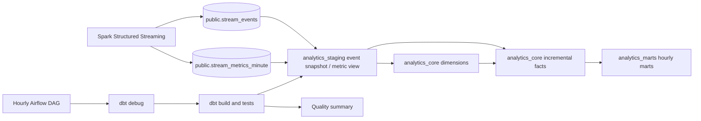

# Phase 3 analytics design

## Scope

Phase 3 turns the durable Phase 2 PostgreSQL event tables into documented analytics
models and runs them as finite batch work. It does not change Kafka, Spark, the lake,
streaming checkpoints or the public Phase 2 warehouse contract. Dashboard APIs,
anomaly detection, telemetry, AI and cloud deployment remain later phases.

The implementation pins dbt Core 1.12.2, dbt-postgres 1.11.0 and Apache Airflow
3.3.0. PostgreSQL remains on the Phase 2 version 16.9 image. The dbt and Airflow
containers are opt-in Compose profiles, so the default foundation stack remains
lightweight.

## Data flow and ownership



Spark owns `public.stream_events` and `public.stream_metrics_minute`. dbt declares
those relations as sources and never mutates them. dbt owns three separate schemas:
`analytics_staging`, `analytics_core` and `analytics_marts`. The event staging model
is a rebuilt table: one PostgreSQL statement captures a
committed source snapshot for all downstream dimensions and facts. Minute metrics
remain a source-quality view; dimensions and marts are rebuilt tables, and facts
are incremental tables.

All model timestamps retain timezone-aware PostgreSQL types and are bucketed in UTC.
Every fact retains its source event UUID. Deterministic MD5 keys make dimension joins
stable across rebuilds; the original business IDs remain visible.

## Models and grains

| Model | Materialization | Exact grain and interpretation |
| --- | --- | --- |
| `stg_stream_events` | Table | One accepted, durably unique Phase 2 event at build capture |
| `stg_stream_metrics_minute` | View | One Phase 2 event-time minute and event type |
| `dim_customers` | Table, Type 1 | One observed customer ID, with first/last event times and source count |
| `dim_products` | Table, Type 1 | One observed product ID, with first/last event times and source count |
| `dim_regions` | Table | One contract region: `us-east`, `us-west`, `eu-west` or `ap-south` |
| `fct_orders` | Incremental | One `order_created` source event; it is not revenue |
| `fct_payment_attempts` | Incremental | One `payment_processed` or `payment_failed` result event |
| `fct_shipments` | Incremental | One `shipment_created` event; matching delay events are attributes, not new shipments |
| `fct_refund_requests` | Incremental | One `refund_requested` event; it does not imply settlement |
| `mart_revenue_hourly` | Table | One successful-payment event hour and region |
| `mart_payment_health_hourly` | Table | One payment-attempt event hour and region |
| `mart_shipment_health_hourly` | Table | One shipment-creation cohort hour and region |
| `mart_refunds_hourly` | Table | One refund-request event hour and region |
| `mart_operations_health_hourly` | Table | One UTC event hour and region observed by any operational fact |

`fct_shipments` joins every accepted `shipment_delayed` event for the same order into
the created shipment row. It exposes whether the shipment was delayed, the count and
first/last timestamps, plus source delay UUIDs. A later delay updates that existing
row on the next run. Contract v1 has no shipment ID, so attribution assumes at most
one creation per order, as emitted by the generator. A business test fails on multiple
creations for one order instead of accepting inflated cohort metrics. Delay events
without an accepted creation remain in staging and cannot be assigned to a creation
cohort; they are not interpreted as shipments.

## Metric definitions

- Revenue is the sum of `payment_processed.amount` only. Order amounts are not counted
  again, and failed payments are excluded.
- Payment failure rate is failed payment attempts divided by all processed plus failed
  attempts in the event-time hour and region.
- Delayed shipment rate is created shipments with at least one associated delay event
  divided by all shipments created in that creation-hour cohort and region. It is not
  a count of delay occurrences in the hour when a delay was reported.
- Refund metrics count requests and requested amounts. They are not completed refunds.
- Operations health combines these components into an analytical feature table. It
  does not classify anomalies or create incidents. Refund requests per order uses
  same-hour request events divided by created orders and may exceed one.

Rates return null when their denominator is absent. Zero refund requests with
existing orders yields a zero request-per-order ratio. dbt tests reject out-of-range
payment and shipment rates, negative fact amounts, invalid statuses, broken dimension
relationships, duplicate lineage IDs and invalid Phase 2 minute windows.

## Incremental, replay and late-arrival behavior

Facts use `source_event_id` as their incremental merge key with PostgreSQL
delete-and-insert semantics. They rescan the relevant accepted source event type on
each run instead of filtering on ingestion time. This deliberately favors correctness
for the local workload: a replayed event UUID cannot inflate a fact, and a late event
that Phase 2 accepted into `stream_events` appears on the next dbt run. Dimensions and
marts rebuild from current facts, so corrected delay attributes and hourly aggregates
converge on the same run.

Phase 2's ten-minute streaming watermark still controls which very late events reach
the warehouse at all. Events excluded there remain only in raw storage until a future
offline reconciliation path exists. dbt does not bypass or weaken that boundary.

## Finite orchestration and failure behavior

The `pulseforge_analytics` DAG runs hourly at minute zero in UTC, with catchup disabled
and one active run. Its only dependency chain is:

```text
verify_warehouse -> dbt_build -> quality_summary
```

`verify_warehouse` runs `dbt debug`. `dbt_build` builds all models and executes their
tests in dependency order. The summary task reads dbt's machine-readable run results,
prints compact counts and exits nonzero for any status other than success/pass,
including skipped or unknown results. Empty and malformed result sets fail closed. Spark and its
checkpoints are absent from the DAG and remain independently operated.

| Failure | Observable behavior | Recovery |
| --- | --- | --- |
| PostgreSQL unavailable | Connection check fails; Airflow retries twice, then the DAG fails | Restore PostgreSQL and rerun the finite DAG |
| Model SQL error | `dbt_build` exits nonzero; downstream summary does not run | Fix the model and rerun; source tables are unchanged |
| dbt data test failure | `dbt_build` fails after recording the test result | Repair source/model semantics, then rerun |
| Summary cannot read valid results | Summary exits nonzero and the DAG is marked failed | Inspect task/dbt logs and rerun after correction |
| Spark failure | Analytics can read the last committed warehouse state; no DAG task restarts Spark | Recover Spark from its existing Phase 2 checkpoints |

Task retries are bounded, task execution timeouts are explicit and failed work remains
visible in Airflow. There is no unbounded scheduler loop inside a task.

## Concurrent ingestion and publication

The event staging table freezes source rows visible when its SELECT starts. Spark
can commit additional events without waiting for the analytics build; those rows
enter analytics on the next full build. All fact and dimension transformations read
the same staging table, avoiding customer/product joins across different source cuts.
No ingestion timestamp cutoff or event-time cutoff discards accepted late data.
UTC hour buckets explicitly pass 'UTC' to PostgreSQL date_trunc, independent of the
database or dbt worker connection timezone.

A dbt build is not an atomic publication of the entire analytics schema. Each model
commits independently, and a failed data test can leave newly built relations present.
Readers may see mixed generations while a build is running or after a failure; use
only a successful completed build for reporting and rerun the whole build after repair.
Do not run manual dbt builds concurrently with the Airflow DAG against the same target
schema. Airflow serializes its own DAG runs; it cannot serialize external CLI invocations.
The source tables, streaming ledger and checkpoints are never rolled back or changed
by analytics failures. No source locks are held across the analytics DAG.

## Local security and resources

Airflow uses a named volume for its own SQLite metadata and generated simple-auth
password file; it does not store scheduler state in the PulseForge warehouse. The
generated `pulseforge` admin password has no checked-in default. Airflow binds only to
`127.0.0.1:8080`, as do the existing published services. The local stack has no TLS
and must not be exposed to the Internet.

The dbt container is capped at 768 MB and exits after a command. Airflow is capped at
1536 MB. Spark continues to use its separate Phase 2 limit. Local analytics uses the
same generated PostgreSQL development credential as the foundation, so source
read-only ownership is enforced by model boundaries rather than database grants.
A production deployment must use a least-privilege transformation role.

## Verification contract

CI retains the existing Python and full streaming jobs, then adds an independent
analytics job. That job starts PostgreSQL, builds both analytics images, compiles dbt,
imports the real Airflow DAG and executes deterministic analytics acceptance tests in
a disposable PostgreSQL database.

The acceptance fixture loads the exact Phase 2 schema and sink path, including a
replayed source event, then runs dbt twice. It asserts exact dimension/fact counts,
revenue, payment failure rate, shipment-delay attribution, refund requests, lineage
uniqueness and stable rerun totals. Phase 3 completion evidence and known limits are
recorded in the [verification report](../verification.md).

UTC bucketing uses PostgreSQL's documented [timezone argument](https://www.postgresql.org/docs/16/functions-datetime.html#FUNCTIONS-DATETIME-TRUNC).
